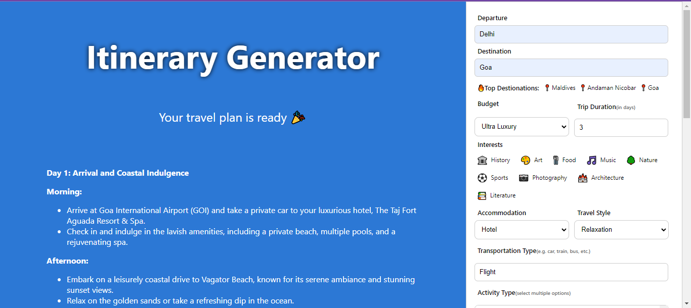

# Travel Buddy_Team Unleashers
# Voyagehacks: Unleash the Travel Innovation

## Theme
Mashups - Packages, Calendar, Itineraries (Generative AI)

## Team Members
- [Aayush Patel](https://github.com/ashu-rb)
- [Abhijeet Thakur](https://github.com/AbhijeetThakur1)
- [Aaryan Arora ](https://github.com/aaryan2134)
- [Abhishek Kumar Singh](https://github.com/Abhishek17696)
- [Aditya Sharma](https://github.com/Aditya-Sharma-dev)
  
## Presentation
[Link](https://www.canva.com/design/DAF4ooIQbBg/_mHsDM0_3pGlyRcQR_ohdw/view?utm_content=DAF4ooIQbBg&utm_campaign=designshare&utm_medium=link&utm_source=editor)

## Travel Buddy Prototype Demo 
[Link](https://drive.google.com/drive/folders/1jMiMnFsHpYzS1EScQN64FJUu7TfuzYfb?usp=sharing)

## How to run it?
1. **Navigate to the project directory:**
   ```bash
   cd itinerary-generator
2. **Install dependencies using npm:**
   ```bash 
   npm install
3. Obtain an API key for Gemini Pro from [here](https://makersuite.google.com/app/apikey)
4. Add the obtained API key to line 6 in the `app.js` file.
5.  Start the application:
    ```bash
    npm run start
   
## Screenshots





